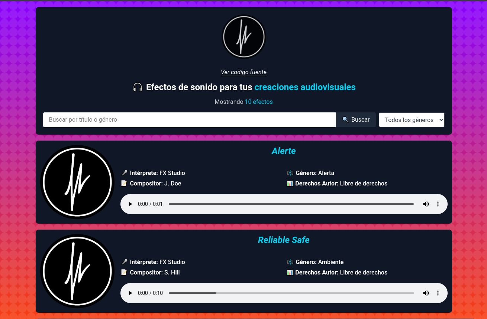

# Audios App

Aplicacion para reproducir efectos de audio libres de copyright

[🌐 Ver proyecto en linea](https://keinermendoza.pythonanywhere.com)

## Tabla de Contenido

- [Introducción](#introducción)
- [Requisitos](#requisitos)
- [Tecnologías Utilizadas](#tecnologias-utilizadas)

## Requisitos

- Python 3.10.12  
- pip 22.0.2  

## Tecnologías Utilizadas

Este proyecto integra varias herramientas y bibliotecas modernas para mejorar la experiencia de desarrollo y el rendimiento de la aplicación:

- [Django](https://docs.djangoproject.com/en/stable/) – Framework web de alto nivel para Python que fomenta un desarrollo rápido y un diseño limpio y pragmático.
- [Jazzmin](https://github.com/farridav/django-jazzmin) – Tema personalizable que mejora la interfaz del panel de administración de Django con un diseño moderno y opciones visuales avanzadas.
- [Cloudinary](https://cloudinary.com/) – Plataforma para gestión y entrega de imágenes y videos optimizada para la web.
- [Tailwind CSS](https://tailwindcss.com/) – Framework de utilidades CSS para crear diseños modernos y responsivos directamente desde el HTML.
- [django-import-export](https://django-import-export.readthedocs.io/en/stable/) – Aplicación que facilita la importación y exportación de datos en el admin de Django utilizando formatos como CSV, Excel, JSON, entre otros.

